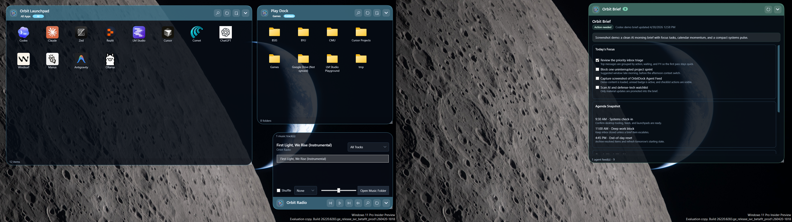
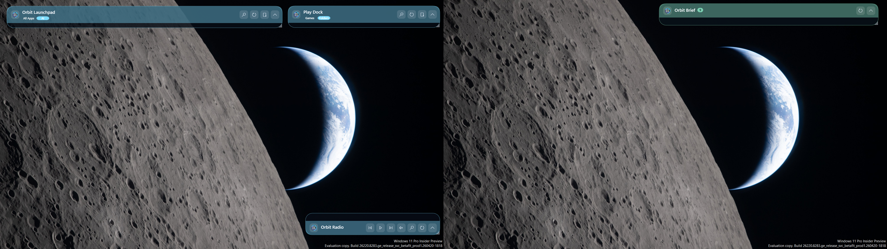
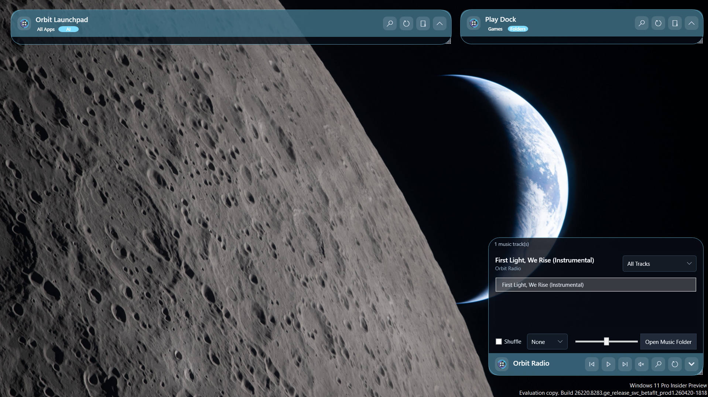

# OrbitDock

<p align="center">
  
</p>

<p align="center">
  A safe, open-source Windows desktop organizer with sleek docks, clean layouts, local music, and agent-accessible control.
</p>

<p align="center">
  
  
  
  
</p>

OrbitDock is a native Windows desktop organizer. It creates customizable desktop docks that group app shortcuts, mirror folders, roll up out of the way, remember different monitor layouts, and stay behind normal app windows.

This project is independent. It is not affiliated with Stardock and does not copy Stardock assets, branding, or proprietary behavior. OrbitDock is built around a safer open-source posture: virtual organization first, explicit file mutations only, readable local config, and durable recovery scripts.

## Screenshots

<p align="center">
  
</p>

<p align="center">
  
  
</p>

## Highlights

- Native WPF dock windows with translucent OrbitDock branding.
- Smart desktop categories for apps, dev tools, creative apps, games, utilities, folders, and files.
- Folder portals that mirror real folders from the desktop.
- Clean desktop mode that hides the raw Windows icon grid while OrbitDock is running.
- OrbitDock-managed desktop pins for items that should remain visible.
- Named layout profiles with dock positions, collapsed state, active tabs, item ordering, dock membership, and desktop pins.
- Screen-combination-aware layout variants for one-monitor and multi-monitor setups.
- Per-dock search, roll-up/collapse, bottom expansion, tabs, and themed scrollbars.
- Optional local sound effects and an optional music dock backed by `%USERPROFILE%\Music\OrbitDock`.
- Agent feed docks for local agents to publish briefs, checklists, unread badges, and status summaries.
- Tray menu, startup registration, `Ctrl+Alt+Space` layer reset, settings UI, and repair/center actions for docks.
- `orbitdockctl` CLI for local agents and scripts.
- Atomic workspace writes with a lock file.

## Safety Defaults

OrbitDock starts as a portal-first organizer. It does not rearrange or delete your real desktop items by default.

- Smart-dock organization is virtual.
- Explicit folder docks copy dropped files by default.
- Remove-from-dock hides an item from that dock only.
- Moving a real item to the Recycle Bin is a separate confirmed context-menu action.
- Rule automation is disabled by default.
- Missing folders, missing audio, unsupported files, and shell-integration failures are recoverable.
- `scripts\show-desktop-icons.ps1` can restore the raw Windows desktop icon grid if needed.

See [docs/safety.md](docs/safety.md) for the full safety model.

## Requirements

- Windows 10 or 11
- .NET 8 SDK with the Windows Desktop runtime

## Quick Start

```powershell
dotnet restore
dotnet build OrbitDock.sln
dotnet run --project src\OrbitDock.App
```

Run the verification suite:

```powershell
dotnet run --project tests\OrbitDock.Tests
```

## Desktop Test Build

For normal local testing, publish a framework-dependent Windows build and launch it from `artifacts`:

```powershell
.\scripts\publish-portable.ps1
.\scripts\start-orbitdock.ps1 -FromPublish
```

Open settings immediately:

```powershell
.\scripts\start-orbitdock.ps1 -FromPublish -Settings
```

Stop OrbitDock:

```powershell
.\scripts\stop-orbitdock.ps1
```

Create desktop shortcuts for the published test build:

```powershell
.\scripts\install-test-shortcut.ps1 -SettingsShortcut
```

Repair desktop shortcuts and the current-user Startup shortcut after moving the repo:

```powershell
.\scripts\install-test-shortcut.ps1 -SettingsShortcut -StartupShortcut
```

## Configuration

OrbitDock stores a human-readable workspace at:

```text
%APPDATA%\OrbitDock\workspace.json
```

If present, legacy `%APPDATA%\CustomFences\workspace.json` is imported once.

Important defaults:

- `defaultDropAction`: `copy`
- `enableRuleAutomation`: `false`
- `hideDesktopIconsWhenRunning`: `true`
- `attachWindowsToDesktop`: `false` by default for reliability
- `enableSoundEffects`: `false`
- `enableMusicDock`: `false`

OrbitDock-managed virtual shortcut folders, including the default AI tab under
`%APPDATA%\OrbitDock\VirtualTabs\AI`, are repaired on app startup/reload. This
keeps Store-app icon paths current after apps such as Claude, Codex, ChatGPT,
or Manus update their versioned `WindowsApps` install folders.

See [docs/configuration.md](docs/configuration.md) for the schema and layout model.

## Agent Control

OrbitDock is local-agent friendly without exposing a network service. Agents should use `orbitdockctl` and the shared workspace JSON:

```powershell
.\scripts\orbitdockctl.ps1 workspace validate
.\scripts\orbitdockctl.ps1 layout list
.\scripts\orbitdockctl.ps1 layout variants
.\scripts\orbitdockctl.ps1 dock set-bounds build 980 455 420 360
.\scripts\orbitdockctl.ps1 dock set-expansion build bottom
.\scripts\orbitdockctl.ps1 item pin "$env:USERPROFILE\Desktop\Visual Studio Code.lnk" --dock build
.\scripts\orbitdockctl.ps1 desktop-pin add "$env:USERPROFILE\Desktop\Steam.lnk" --x 120 --y 220
.\scripts\orbitdockctl.ps1 audio music on
.\scripts\orbitdockctl.ps1 agent-feed publish morning-brief --title "Morning Brief" --summary "Two items need attention." --status attention
```

The running app watches the workspace file and reloads safely after CLI changes.
Agent feed docks also watch `%APPDATA%\OrbitDock\AgentFeeds` so local agent updates appear without restarting OrbitDock.

## Repository Layout

```text
src/
  OrbitDock.App/     WPF desktop app, tray, settings, shell integration, audio
  OrbitDock.Core/    Workspace schema, layout service, rules, scanners, storage
  OrbitDock.Cli/     Local CLI for agents and scripts
tests/
  OrbitDock.Tests/   Dependency-light console verification suite
docs/                Architecture, safety, config, testing, audio, roadmap
scripts/             Publish, start, stop, reset, shortcuts, CLI wrapper
screenshots/         Public README screenshots
```

## Documentation

- [Product brief](docs/product-brief.md)
- [Architecture](docs/architecture.md)
- [Configuration](docs/configuration.md)
- [Agent control](docs/agent-control.md)
- [Agent feeds](docs/agent-feeds.md)
- [Audio](docs/audio.md)
- [Safety](docs/safety.md)
- [Desktop testing](docs/testing.md)
- [Roadmap](docs/roadmap.md)
- [Visual direction](docs/visual-direction.md)
- [Research notes](docs/research-notes.md)

## Project Status

OrbitDock is alpha software. It is usable for local desktop testing, but Windows shell behavior, multi-monitor transitions, mixed-DPI setups, and Explorer restart recovery still need broader real-world testing.

## Contributing

See [CONTRIBUTING.md](CONTRIBUTING.md). Keep changes small, testable, and conservative around filesystem and shell behavior.

## License

MIT. See [LICENSE](LICENSE).
