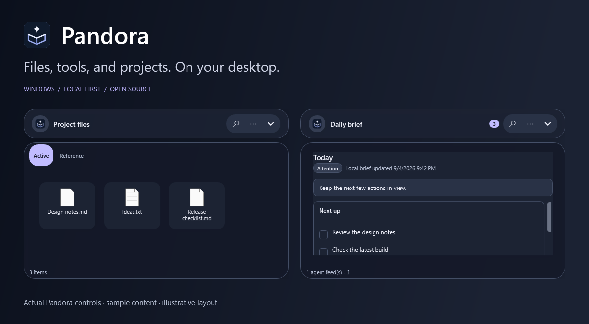
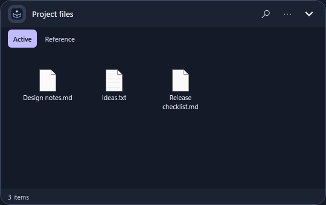
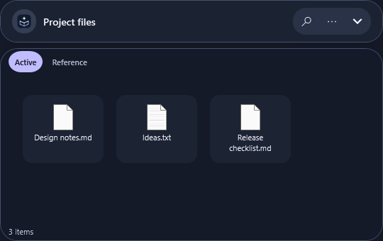
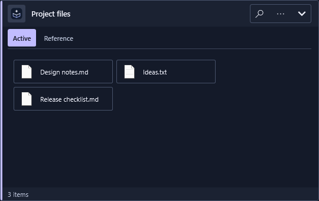
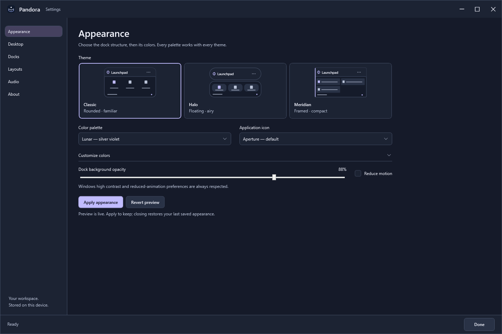
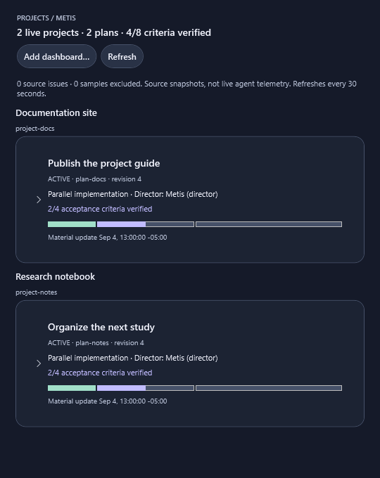

# Pandora

**Files, tools, and projects. On your desktop.**

Pandora is a Windows desktop organizer with customizable docks, folder tabs, saved layouts, local music, and an optional view of long-running Metis projects. No account or cloud service required.

[](https://github.com/RedLynx101/Pandora/actions/workflows/ci.yml) · [MIT](LICENSE) · Windows 10/11 · .NET 8 · **Alpha**



## What you can do

- **Organize without relocating files.** Group shortcuts into virtual docks, or browse real folders in tabs. Save layouts for different monitor setups.
- **Make it fit your desktop.** Pick a structural theme, then a palette. Adjust bar size, colors, and glass opacity. Give each dock a custom icon, no icon, or the default Pandora mark.
- **Keep useful things close.** Roll docks into their headers, search items, pin shortcuts, and play local music.
- **Follow multiple projects.** See Metis phases, assigned agents, verified progress, and attention items in one read-only Projects dock.
- **Connect local tools.** Publish briefs and checklists or manage layouts through the CLI.

Smart-dock organization is virtual. Folder drops copy by default; deleting a real file requires a separate confirmation. [Safety details →](docs/safety.md)

## Try it

This is a **build-from-source alpha**, not a signed installer. You need Windows 10 or 11 and the .NET 8 SDK with Windows Desktop support.

```powershell
git clone https://github.com/RedLynx101/Pandora.git
cd Pandora
dotnet build Pandora.sln
.\scripts\start-pandora.ps1 -NoBuild -Settings
```

Use the tray icon to reopen Settings. Double-click a dock header to roll it up; press **Ctrl+Alt+Space** to send docks behind active windows. Starting with Windows is opt-in. Settings and layouts stay in `%APPDATA%\Pandora`.

For a portable build, run `.\scripts\publish-portable.ps1`, then `.\scripts\start-pandora.ps1 -FromPublish`. Publishing does not install the app or enable startup. [Setup and recovery →](docs/getting-started.md)

## Structure first. Color second.

Every palette works with every dock theme. Choose Lunar, Midnight, Limestone, Aegean, or System, then optionally adjust the accent and surface colors.

| Classic | Halo | Meridian |
| --- | --- | --- |
| Integrated frame and compact header | Floating rounded header and airy grid | Crisp frame, accent rail, horizontal tiles |
|  |  |  |

Header and body transparency leave text readable. Compact, Standard, and Large bars scale names and controls together. Aperture is the default product icon; Selene and Aster are also available.

<details>
<summary>Appearance settings</summary>



</details>

## A home for Metis projects

Register an existing local Metis dashboard from the Projects dock or CLI. Pandora reads its embedded JSON without running the HTML or changing the plan.



Plans remain independent. The view distinguishes implemented work from verified acceptance, declared team budgets from live usage, and source freshness from agent liveness. Pandora displays progress; it does not direct agents or approve work. [Connect a project →](docs/metis-projects.md)

Images above are **actual WPF controls with sample content**, rendered offscreen—not captures of a live desktop. [Image provenance →](screenshots/README.md)

## Local automation

```powershell
.\scripts\pandoractl.ps1 workspace validate
.\scripts\pandoractl.ps1 layout list
.\scripts\pandoractl.ps1 project add "C:\Projects\Example\dashboard.html"
.\scripts\pandoractl.ps1 agent-feed publish morning-brief --title "Morning Brief" --summary "Two items need attention." --status attention
```

The app watches local changes. Use the CLI for coordinated writes instead of overwriting a live workspace. [CLI guide](docs/agent-control.md) · [Agent feeds](docs/agent-feeds.md)

## Status and development

Pandora is alpha software. Explorer integration, real monitor transitions, mixed-DPI behavior, and compositor transparency still need broader hardware testing. Automated checks and offscreen renders do not establish that coverage.

[Contribute](CONTRIBUTING.md) · [Run the tests](docs/testing.md) · [Architecture](docs/architecture.md) · [Configuration](docs/configuration.md) · [Roadmap](docs/roadmap.md) · [Report an issue](https://github.com/RedLynx101/Pandora/issues/new/choose) · [Security](SECURITY.md)
