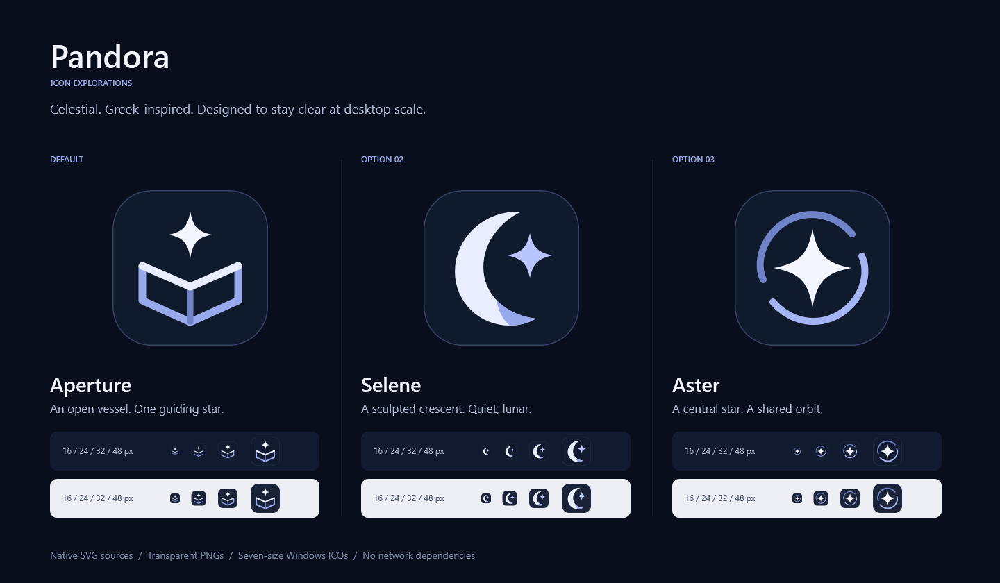

# Pandora icon options



**Aperture is the default.** A silver star rises from an open vessel: a simple
reference to Pandora, while the open geometry also suggests a place to collect
and see your work. The midnight tile and blue-violet edges fit the translucent
celestial interface without needing a starfield or elaborate mythology.

Two alternatives are included:

- **Selene:** a sculpted crescent and star. The quieter, explicitly lunar option.
- **Aster:** a guiding star inside two orbital arcs, for a more geometric mark.

These are original geometric, code-native marks, not AI raster generations.
Their Greek-inspired option labels are design directions, not additional product
names: the application remains **Pandora** whichever icon is selected.

## Files and selection

All application assets are in `src/Pandora.App/Assets/Brand/`. `Pandora.svg`,
`Pandora.png`, `Pandora.ico`, and `Pandora-<size>.png` are the default assets.
The alternatives use the prefixes `Pandora-Selene` and `Pandora-Aster`.

Each option has transparent-background PNGs at **16, 24, 32, 48, 64, 128, and
256 pixels**, a 256-pixel preview PNG, and an ICO containing all seven PNG frames.
Transparency is outside the rounded tile; the tile itself is nearly opaque for
contrast on busy wallpapers. App icons intentionally remain constant when the
interface theme changes, so they are recognizable on the taskbar and desktop.

Choose **Aperture**, **Selene**, or **Aster** in the application's appearance
settings. The saved `IconStyle` selects the corresponding prefixed assets; the
bundled executable's default icon remains Aperture. Installed shortcut icon
changes may also depend on Windows' icon cache. Do not rename one SVG over another
to change the preference: preserve all three named sources for consistent exports.

## Regenerate

On Windows, from the repository root:

```powershell
powershell.exe -NoProfile -ExecutionPolicy Bypass -File scripts/generate-pandora-brand.ps1
```

The generator reads the three SVG source files and produces matching PNGs, ICOs,
and the contact sheet. It requires only Windows WPF and System.Drawing; no Node,
Python, web browser, remote fonts, or network access. Segoe UI labels the contact sheet.

The SVG renderer deliberately accepts only solid-painted paths, rounded
rectangles, and circles. It rejects unsupported elements or attributes instead
of silently producing a mismatched export. External XML resources are disabled.
After changing a source, regenerate and inspect the contact sheet at both large
and native icon sizes before committing.
